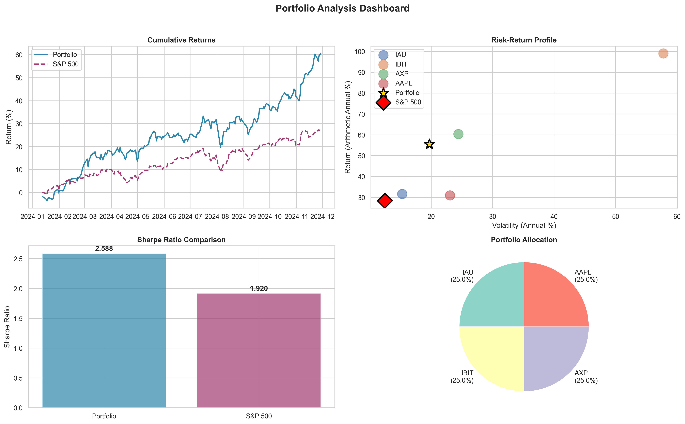

# Portfolio Risk-Adjusted Return Analyzer

A Python tool for analyzing investment portfolio performance, focusing on risk-adjusted returns (Sharpe Ratio) and benchmarking against the S&P 500.



## Features

- **Automated Data Fetching**: Retrieves historical price data from Yahoo Finance.
- **Risk-Adjusted Analysis**: Calculates Sharpe Ratio, Annualized Volatility, and Maximum Drawdown.
- **Benchmarking**: Automatically compares portfolio performance against the S&P 500 (SPY).
- **Smart Data Handling**: Automatically aligns data to the shortest common history for all assets.
- **Visual Dashboard**: Generates a comprehensive 4-panel visualization:
    - Cumulative Returns
    - Risk-Return Scatter Plot
    - Sharpe Ratio Comparison
    - Asset Allocation

## Installation

1. Clone the repository:
   ```bash
   git clone https://github.com/yourusername/portfolio-analyzer.git
   cd portfolio-analyzer
   ```

2. Install dependencies:
   ```bash
   pip install -r requirements.txt
   ```

## Usage

1. Open `portfolio_analyzer.py` and configure your portfolio in the `main()` function:

   ```python
   portfolio = {
       'IAU': 0.25,   # Gold
       'IBIT': 0.25,  # Bitcoin
       'AXP': 0.25,   # American Express
       'AAPL': 0.25   # Apple
   }
   ```

2. Run the analysis:
   ```bash
   python portfolio_analyzer.py
   ```

3. View the results in the console and the generated `portfolio_analysis.png` dashboard.

## Methodology

### Sharpe Ratio
The Sharpe Ratio measures the performance of an investment compared to a risk-free asset, after adjusting for its risk. It is defined as the difference between the returns of the investment and the risk-free return, divided by the standard deviation of the investment.

$$ \text{Sharpe Ratio} = \frac{R_p - R_f}{\sigma_p} $$

Where:
- $R_p$ = Expected portfolio return
- $R_f$ = Risk-free rate (default: 4.5%)
- $\sigma_p$ = Portfolio standard deviation (volatility)

## License

This project is open source and available under the [MIT License](LICENSE).
