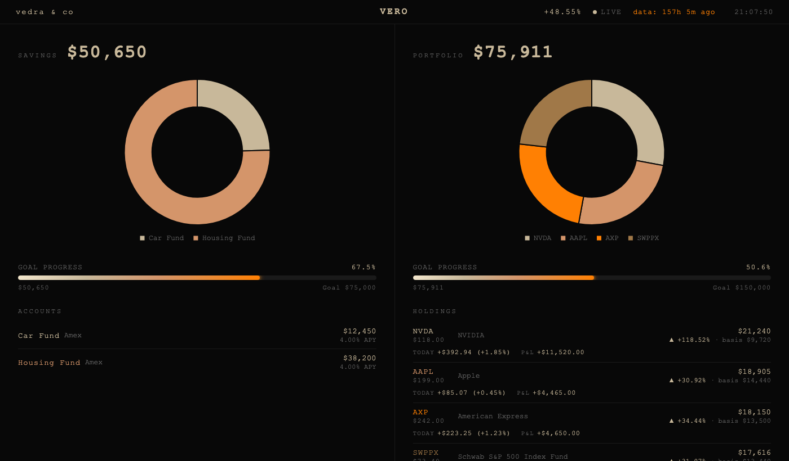

# Vero

> Wake up. Open terminal. Type `brief`.

A terminal-based investment portfolio tracker. Log trades at live or historical prices, track realized and unrealized P&L, run a daily market briefing — stored locally, no accounts required.



---

## Setup

Requires Python 3.9+

```bash
git clone https://github.com/Felixsavedra-1/portfolio-cli.git
cd portfolio-cli
sudo bash setup.sh
```

Installs dependencies and registers `brief` and `portfolio` as system commands.

> **Note:** `sudo` is required because the installer writes to `/usr/local/bin/`.

---

## Quick Start

```bash
portfolio buy AAPL 1000      # log your first trade
portfolio show               # view holdings
brief                        # run your morning brief + open dashboard
```

Data is stored in `~/.portfolio/` and created automatically on first use. Nothing is written to the project directory.

---

## Morning Brief

```
════════════════════════════════════════════════════════════════════════
  Vero  ·  Monday, April 14, 2026  8:02 AM ET
  @vedra&co
════════════════════════════════════════════════════════════════════════

Savings

  Bank       Account              Balance     APY    Interest/mo
  ────────────────────────────────────────────────────────────────────────────
  Amex       Car Fund          $12,450.00   4.00%    +$41.50/mo
  Amex       Housing Fund      $38,200.00   4.00%   +$127.33/mo
  ────────────────────────────────────────────────────────────────────────────
             Total             $50,650.00           +$168.83/mo

Portfolio

  Value     $75,911.00
  Invested  $51,100.00  ·  since Mar 15, 2022

  Ticker      Price    Wt       $P&L         1D        1W        1M       YTD
  ────────────────────────────────────────────────────────────────────────────
  NVDA      $118.00   28%  +$11,520.00    +1.85%   +3.20%  +18.50%   +42.10%
              mkt $21,240  ·  cost $9,720  ·  gain +$11,520 (+118.52%)
  AAPL      $199.00   25%   +$4,465.00    +0.45%   -1.10%   +4.20%   +14.30%
              mkt $18,905  ·  cost $14,440  ·  gain +$4,465 (+30.92%)
  AXP       $242.00   24%   +$4,650.00    +1.23%   +3.10%  +18.50%   +42.10%
              mkt $18,150  ·  cost $13,500  ·  gain +$4,650 (+34.44%)
  SWPPX *    $73.40   23%   +$4,176.00    +0.41%   +1.20%   +4.80%   +12.30%
              mkt $17,616  ·  cost $13,440  ·  gain +$4,176 (+31.07%)
  ────────────────────────────────────────────────────────────────────────────
  Portfolio    —       —   +$24,811.00    +0.98%   +1.60%  +11.20%   +25.40%
  S&P 500      —       —            —     +0.30%   +0.80%   +3.10%    +8.40%
  Alpha        —       —            —     +0.68%   +0.80%   +8.10%   +17.00%

Watchlist

  Company              Ticker   Price       1D        1W        1M   Signal
  ────────────────────────────────────────────────────────────────────────────
  JPMorgan             JPM    $248.30   +0.15%   +0.40%   +1.20%   ~ NEUTRAL   mixed signals
  Alphabet             GOOGL  $156.80   -0.82%   -2.10%   -5.30%   ▼ BEARISH   downtrend
  Meta Platforms       META   $592.40   +2.14%   +3.60%   +8.50%   ▲ BULLISH   strong momentum

Global markets  (local currency)

  S&P 500    (US)              ▲    +0.30%   today
  FTSE 100   (UK)              ▼    -0.12%   today
  Nikkei 225 (Japan)           ▲    +0.85%   today

Risk snapshot  (trailing 1 year)

  Sharpe 1.42 [0.98, 1.86]  ·  Volatility 14.2%  ·  Max Drawdown -8.3%

════════════════════════════════════════════════════════════════════════
```

Direction arrows are color-coded: green ▲ up, red ▼ down, orange ~ neutral.

---

## Commands

```bash
# Portfolio
portfolio buy  TICKER DOLLARS
portfolio buy  TICKER DOLLARS --date 2024-01-15
portfolio buy  TICKER DOLLARS --date 2024-01-15 --price 185.20 --notes "opened"
portfolio sell TICKER DOLLARS
portfolio sell TICKER DOLLARS --date 2024-06-10
portfolio show
portfolio gains
portfolio gains --ticker AAPL
portfolio history
portfolio history --ticker AAPL --limit 10
portfolio remove TICKER

# Savings
portfolio savings set   "Car Fund" 12450 --apy 4.0 --bank "Amex"
portfolio savings set   "Car Fund" 13000            # update balance only
portfolio savings set   "Car Fund" --bank "Amex"    # update bank only
portfolio savings remove "Car Fund"

# Goals (shown as progress bars in the dashboard)
portfolio goal set portfolio 200000   # set total portfolio target
portfolio goal set savings   50000    # set total savings target
portfolio goal remove portfolio
portfolio goal show
```

Data is stored in `~/.portfolio/`.

---

## Dashboard

The morning brief automatically opens an interactive dashboard in your browser.

```bash
brief                  # brief + dashboard
python dashboard.py    # dashboard only
```

> **Headless / Linux servers:** If no display is available, the browser won't open. The dashboard HTML path is printed instead — copy it into a local browser or `scp` the file to view it.


---

## Configuration

Overrides go in `config_local.py` (gitignored):

```python
WATCHLIST = {
    'JPM':  'JPMorgan',
    'NVDA': 'Nvidia',
}
```

| Setting | Default | Description |
|:---|:---|:---|
| `WATCHLIST` | `{}` | Tickers shown in the watchlist |
| `MUTUAL_FUNDS` | `frozenset()` | NAV-lagged tickers, flagged `*` in the brief |
| `BENCHMARK` | `SPY` | Benchmark for alpha calculation |
| `RISK_FREE_RATE` | `0.045` | Annual risk-free rate for Sharpe |
| `GLOBAL_INDICES` | *(see config.py)* | Markets shown in the global section |
| `BRIEF_TIMEZONE` | `America/New_York` | Timezone for the brief header |

---

## Deep Analysis

```bash
python portfolio_analyzer.py
```

Tearsheet (CAGR, Sharpe with Lo 2002 CI, volatility, max drawdown) and a 6-panel chart saved to `~/.portfolio/portfolio_analysis.png`.

---

## Tests

```bash
pytest tests/
```

All tests are network-free.

---


